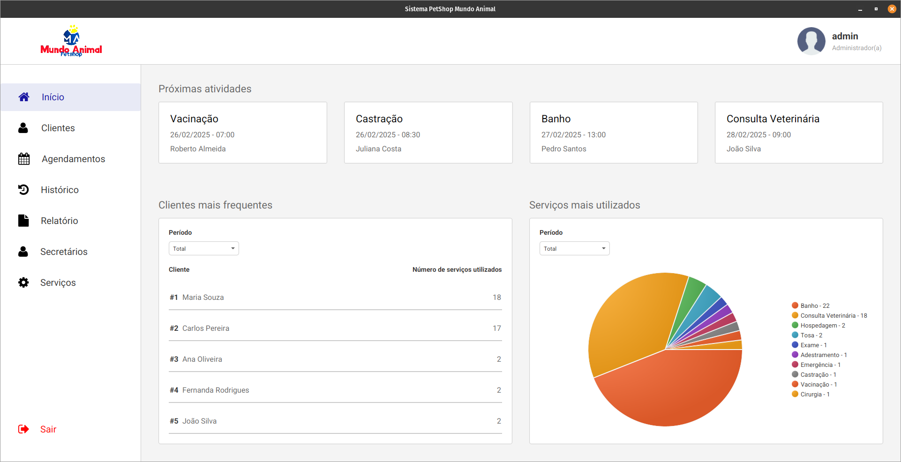
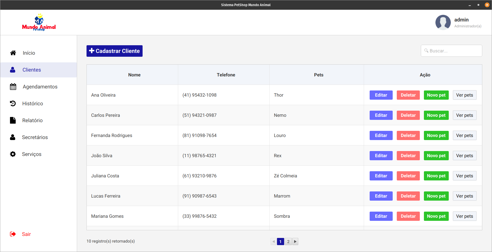
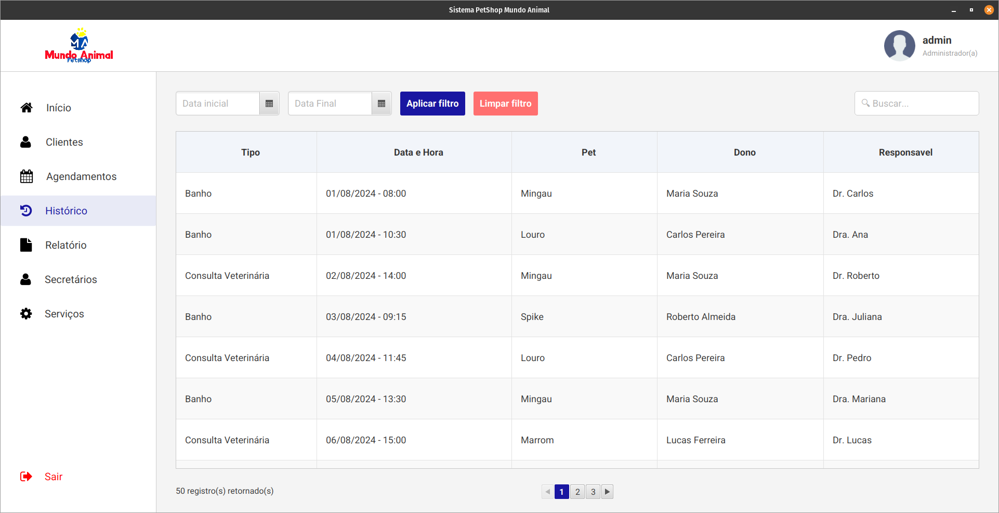

# 🐾 Mundo Animal - Sistema de Gestão para Petshop

Mundo Animal é um sistema desktop desenvolvido em **JavaFX** com **PostgreSQL** e **Hibernate (JPA)**, projetado para a gestão eficiente de um petshop. O sistema permite o gerenciamento de clientes, animais, agendamentos, serviços e secretários.

## 🚀 Tecnologias Utilizadas
- **Java 23**

- **JavaFX** 
- **PostgreSQL** 
- **Hibernate/JPA** 
- **Maven** 
- **Docker** 

## 📌Funcionalidades Principais
- **Autenticação:** Login seguro para administradores e secretários.
- **Gerenciamento de Agendamentos:** Exibição dinâmica dos próximos atendimentos na tela inicial.
- **Cadastro de Clientes e Animais:** Relacionamento entre clientes e seus respectivos pets.
- **Controle de Serviços:** Registros de atendimento e relatório de operações.
- **Interface intuitiva:** Com animações suaves e pop-ups de confirmação.

## 🛠️ Instalação e Execução
### Pré-requisitos
- Java 21+ instalado
- PostgreSQL instalado 
- Maven instalado

## 📷 Screenshots

## 📜 Licença
Este projeto está sob a licença MIT. Veja o arquivo [LICENSE](LICENSE) para mais detalhes.